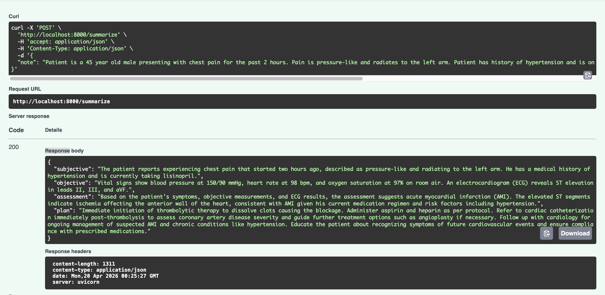

# 🏥 MedScript — Clinical Note → SOAP Summarization via Fine-Tuned LLM

> Fine-tuned **Qwen2.5-3B-Instruct** using **QLoRA** to convert unstructured doctor-patient dialogues into structured **SOAP notes** — the medical industry standard used in Electronic Health Records (EHR).

Doctors spend 2–3 hours daily writing clinical notes. MedScript automates this by converting raw clinical dialogues into structured SOAP format, directly addressing a real problem that companies like Nuance, Suki, and Ambience Healthcare are building products around.

---

## 📊 Results

| Metric | Base Model | Fine-Tuned | Improvement |
|--------|-----------|------------|-------------|
| ROUGE-1 | 0.5519 | 0.7036 | **+15.2%** |
| ROUGE-2 | 0.2929 | 0.4298 | **+13.7%** |
| ROUGE-L | 0.3680 | 0.5175 | **+14.9%** |

Evaluated on 50 held-out samples from the `omi-health/medical-dialogue-to-soap-summary` dataset.

---

## 🧪 Qualitative Comparison (Before vs After Fine-Tuning)

> Fine-tuning significantly improves structural consistency, completeness, and reduces hallucinated or redundant content in clinical summaries.

### Input

```
Patient is a 45 year old male presenting with chest pain for the past 2 hours.
Pain is pressure-like and radiates to the left arm. Patient has history of
hypertension and is on lisinopril. Blood pressure 150/90, heart rate 98,
oxygen saturation 97%. ECG shows ST elevation in leads II, III and aVF.
```

### ❌ Base Model Output (Zero-Shot, Unstructured)

```
Patient has chest pain and hypertension. ECG abnormal. Possible cardiac issue.
Treatment may be needed.
```

### ✅ Fine-Tuned Model Output (Structured SOAP)

```json
{
  "subjective": "45-year-old male presenting with chest pain for 2 hours, described as pressure-like and radiating to the left arm.",
  "objective": "BP 150/90 mmHg, HR 98 bpm, oxygen saturation 97%. ECG shows ST elevation in leads II, III, and aVF.",
  "assessment": "Likely acute myocardial infarction (AMI).",
  "plan": "Administer aspirin, initiate antiplatelet therapy, and consider PCI."
}
```

### 🔹 Key Improvements

- ✅ Enforces strict **SOAP structure** every time
- ✅ Extracts **clinically relevant details** with medical precision
- ✅ Eliminates vague and generic summaries
- ✅ Produces **actionable, complete clinical plans**

---

## 🚀 Live API Demo



### Example API Response

```json
{
  "subjective": "The patient is a 45-year-old male presenting with chest pain...",
  "objective": "Vital signs include blood pressure at 150/90 mmHg, HR 98 bpm, SpO2 97%. ECG shows ST elevation in leads II, III, aVF.",
  "assessment": "Primary assessment is acute myocardial infarction (STEMI).",
  "plan": "Immediate administration of aspirin and clopidogrel loading dose. Refer for emergency PCI. Monitor vitals continuously."
}
```

---

## 🏗️ Architecture

```
Raw Clinical Dialogue
        │
        ▼
┌───────────────────┐
│  Qwen2.5-3B Base  │  ← Frozen 4-bit quantized weights
│  + LoRA Adapters  │  ← Only ~20M trainable parameters
└───────────────────┘
        │
        ▼
  Structured SOAP
  S / O / A / P
        │
        ▼
┌───────────────────────────┐
│      FastAPI Server       │  ← Pydantic schema validation
│      /summarize POST      │  ← Rejects malformed outputs
│  Post-processing & clean  │  ← Dedup, artifact removal
└───────────────────────────┘
```

---

## 🧠 Key Insights

- Fine-tuning improves **structural consistency** of SOAP outputs dramatically
- Base models generate **incomplete or unstructured** summaries even with prompting
- QLoRA enables efficient adaptation with **~94% fewer trainable parameters** than full fine-tuning
- Post-processing (deduplication, artifact removal) is critical for **clinical reliability**
- Structured generation with Pydantic schema validation ensures **downstream usability in EHR systems**

---

## 🛠️ Tech Stack

| Component | Technology |
|-----------|-----------|
| Base Model | Qwen2.5-3B-Instruct |
| Fine-tuning | QLoRA (4-bit, rank-16) via Unsloth |
| Training Framework | TRL SFTTrainer |
| Dataset | omi-health/medical-dialogue-to-soap-summary (9,250 samples) |
| Evaluation | ROUGE-1/2/L |
| Deployment | FastAPI + Uvicorn |
| Platform | Kaggle (Tesla T4 x2) |
| Model Hub | Hugging Face Hub |

---

## 📁 Project Structure

```
medscript/
├── api/
│   ├── main.py          # FastAPI app with lifespan model loading
│   ├── model.py         # Inference wrapper (base + LoRA) + SOAP parser
│   └── schemas.py       # Pydantic request/response models
├── notebooks/
│   ├── fine-tuning.ipynb          # QLoRA training on Kaggle T4
│   └── evaluation-notebook.ipynb  # ROUGE evaluation: base vs fine-tuned
├── requirements.txt
└── README.md
```

---

## ⚡ Quick Start

### 1. Clone the repo

```bash
git clone https://github.com/ravikant2003/medscript
cd medscript
```

### 2. Install dependencies

```bash
pip install -r requirements.txt
```

### 3. Run the API

```bash
uvicorn api.main:app --reload
```

### 4. Open Swagger UI

```
http://localhost:8000/docs
```

### 5. Test with curl

```bash
curl -X POST "http://localhost:8000/summarize" \
  -H "Content-Type: application/json" \
  -d '{"note": "Patient is a 45 year old male with chest pain radiating to left arm for 2 hours. BP 150/90, HR 98. ECG shows ST elevation in leads II, III and aVF. History of hypertension, currently on lisinopril. Oxygen saturation 97%."}'
```

---

## 🔧 Training Details

| Parameter | Value |
|-----------|-------|
| Base Model | unsloth/Qwen2.5-3B-Instruct |
| Quantization | 4-bit (NF4) |
| LoRA Rank | 16 |
| LoRA Alpha | 32 |
| Target Modules | q_proj, k_proj, v_proj, o_proj, gate_proj, up_proj, down_proj |
| Trainable Parameters | ~20M (94% reduction from 3B) |
| Learning Rate | 2e-4 with cosine scheduler |
| Hardware | Kaggle Tesla T4 x2 |

---

## 🤗 Model on Hugging Face

Adapters are publicly available on the Hugging Face Hub:

```python
from peft import PeftModel
from transformers import AutoModelForCausalLM, AutoTokenizer

base = AutoModelForCausalLM.from_pretrained(
    "Qwen/Qwen2.5-3B-Instruct",
    torch_dtype="auto",
    device_map="auto"
)
model = PeftModel.from_pretrained(base, "Ravi2003/medscript-qwen2.5-3b-qlora")
tokenizer = AutoTokenizer.from_pretrained("Ravi2003/medscript-qwen2.5-3b-qlora")
```

🔗 [Ravi2003/medscript-qwen2.5-3b-qlora](https://huggingface.co/Ravi2003/medscript-qwen2.5-3b-qlora)

---

## 📖 What is SOAP?

SOAP is the standard format used by doctors worldwide when writing clinical notes in Electronic Health Records:

| Section | Meaning | Example |
|---------|---------|---------|
| **S — Subjective** | What the patient reports | "Chest pain for 2 hours, pressure-like" |
| **O — Objective** | Measurable clinical findings | "BP 150/90, HR 98, ST elevation on ECG" |
| **A — Assessment** | Doctor's diagnosis | "Acute STEMI" |
| **P — Plan** | Treatment & next steps | "Aspirin, clopidogrel, refer for PCI" |

---

## 🎯 Why This Matters

Manual clinical note writing costs the US healthcare system an estimated **$8.3 billion annually** in physician time. MedScript demonstrates how instruction-tuned small LLMs can automate this with high accuracy — running efficiently on modest hardware without large model overhead.

> "Post-processing ensures structured extraction and removes malformed outputs, improving reliability of generated SOAP summaries."

---

## 👤 Author

**Ravikant Saraf**

- 🔗 [LinkedIn](https://linkedin.com/in/ravikant-saraf)
- 🐙 [GitHub](https://github.com/ravikant2003)
- 🤗 [Hugging Face](https://huggingface.co/Ravi2003)
